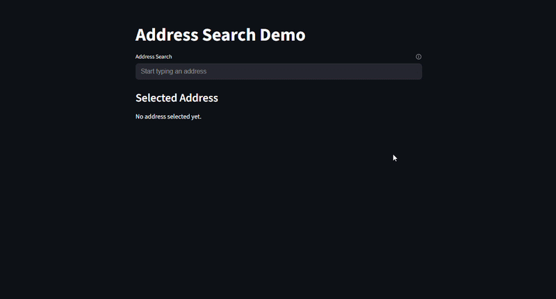

# streamlit-google-places-address

A custom [Streamlit](https://streamlit.io/) component that provides a Google Places-powered address autocomplete input with real-time suggestions and structured output.

This component integrates the [Google Maps JavaScript API](https://developers.google.com/maps/documentation/javascript/overview) and the [Places Autocomplete Data API](https://developers.google.com/maps/documentation/javascript/place-autocomplete-data) into Streamlit applications via a simple Python interface.

## Installation

### From GitHub

Install a tagged version:

    pip install git+https://github.com/kyle-gb-ds/streamlit-google-places-address.git@v0.1.2

Install the latest version from the main branch:

    pip install git+https://github.com/kyle-gb-ds/streamlit-google-places-address.git@main

### For local development

    git clone https://github.com/kyle-gb-ds/streamlit-google-places-address.git
    cd streamlit-google-places-address
    pip install -e .

## Configuration

This component requires a Google Maps API key.

Create a `.streamlit/secrets.toml` file:

    GOOGLE_MAPS_API_KEY = "your-api-key"

## Requirements

Your API key must have the following enabled:

- [Maps JavaScript API](https://developers.google.com/maps/documentation/javascript/overview)
- [Places API](https://developers.google.com/maps/documentation/places/web-service/overview)
- [Places API (New)](https://developers.google.com/maps/documentation/javascript/place-get-started)
- Billing enabled on the Google Cloud project

The API key should be configured as a **browser key** with [HTTP referrer restrictions](https://developers.google.com/maps/api-security-best-practices).

Example referrers for local development:

    http://localhost:8501/*
    http://127.0.0.1:8501/*

## Usage

    import streamlit as st
    from streamlit_google_places_address import address_search

    st.title("Address Search")

    api_key = st.secrets.get("GOOGLE_MAPS_API_KEY")

    if not api_key:
        st.error("Missing API key. Set GOOGLE_MAPS_API_KEY in .streamlit/secrets.toml")
        st.stop()

    result = address_search(
        label="Address",
        api_key=api_key,
        help="Search for and select a suggested address.",
        placeholder="Start typing an address",
        country="za",  # optional
    )

    if result:
        st.json(result)

## Return Value

The component returns a dictionary containing structured address data:

    {
        "place_id": str | None,
        "description": str,
        "main_text": str,
        "secondary_text": str,
        "formatted_address": str,
        "lat": float | None,
        "lng": float | None,
    }

## Parameters

| Parameter | Type | Default | Description |
|---|---|---|---|
| `label` | `str` | — | Label displayed above the input (required). |
| `api_key` | `str` | — | Google Maps browser API key. |
| `placeholder` | `str` | `"Search for an address"` | Placeholder text shown in the input field. |
| `value` | `str` | `""` | Initial input value. |
| `country` | `str \| None` | `None` | Restrict results by ISO 2-letter country code (e.g. `"za"`). |
| `disabled` | `bool` | `False` | Disable the input field. |
| `theme` | `"auto" \| "light" \| "dark" \| None` | `None` | Optional theme override. If not provided, uses default styling. |
| `label_visibility` | `"visible" \| "hidden" \| "collapsed"` | `"visible"` | Controls visibility and spacing of the label. |
| `help` | `str \| None` | `None` | Optional help tooltip displayed next to the label. |
| `key` | `str \| None` | `None` | Unique key for the component instance. |

## Theming

The component supports three modes:

- `auto` — follows system theme via `prefers-color-scheme`
- `light` — forces light styling
- `dark` — forces dark styling

If `theme` is not provided, the component uses its default styling behavior. For the most consistent results in Streamlit apps, pass an explicit theme if needed.

## Features

- Real-time address autocomplete using Google Places
- Debounced input handling
- Keyboard navigation (arrow keys, enter, escape)
- Click and keyboard selection
- Automatic dropdown dismissal on selection or blur
- Optional country-based filtering
- Structured output for downstream use

## Notes

- The component runs entirely in the browser; the API key is visible to users
- Always apply [API key restrictions](https://developers.google.com/maps/api-security-best-practices)
- Do not use server-restricted keys

## Development

### Install dependencies

    pip install -e .
    cd src/streamlit_google_places_address/frontend
    npm install

### Build frontend

    npm run build

### Run example app

    streamlit run example_app.py

## Building the package

From the project root:

    npm run build

This builds the frontend assets and produces a distributable Python package.

For packaging details, see the [Python Packaging User Guide](https://packaging.python.org/en/latest/tutorials/packaging-projects/).

## Versioning

Tagged releases are recommended for stable installs:

    git tag v0.1.2
    git push origin main --tags

Install a specific version:

    pip install git+https://github.com/kyle-gb-ds/streamlit-google-places-address.git@v0.1.2

## License

MIT License. See the [LICENSE](./LICENSE) file for details.

## Acknowledgements

- [Streamlit custom components](https://docs.streamlit.io/develop/concepts/custom-components/overview)
- [Google Maps JavaScript API](https://developers.google.com/maps/documentation/javascript/overview)
- [Places Autocomplete Data API](https://developers.google.com/maps/documentation/javascript/place-autocomplete-data)